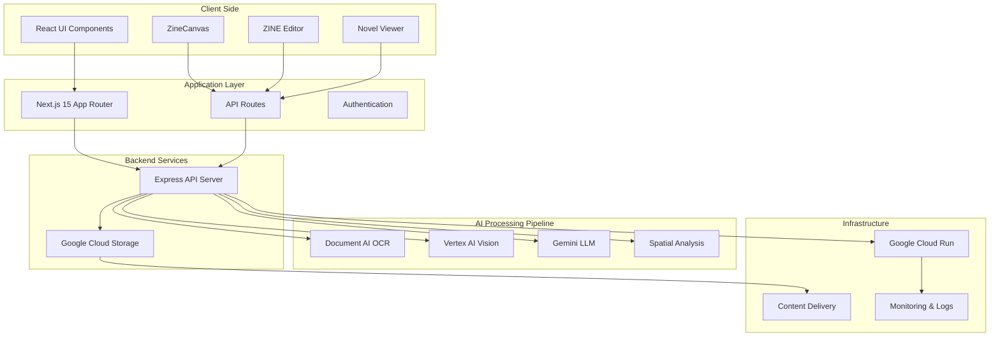
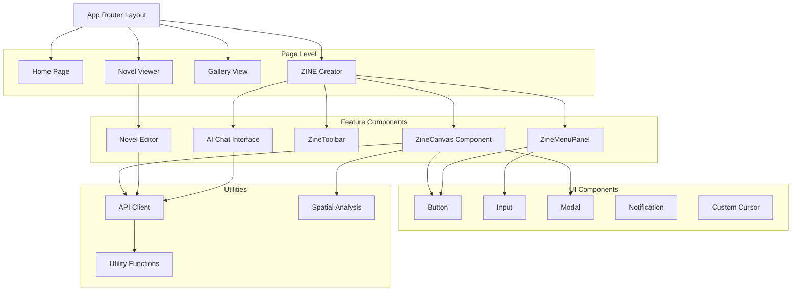
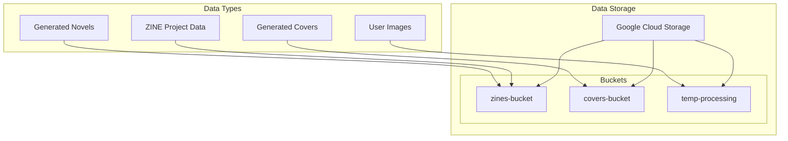
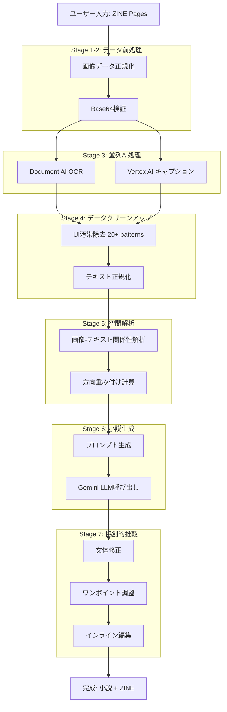
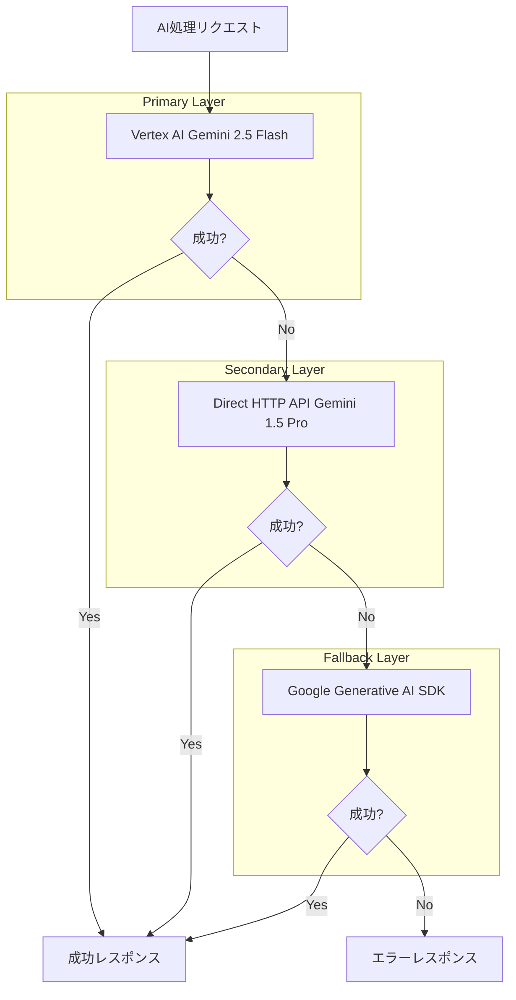
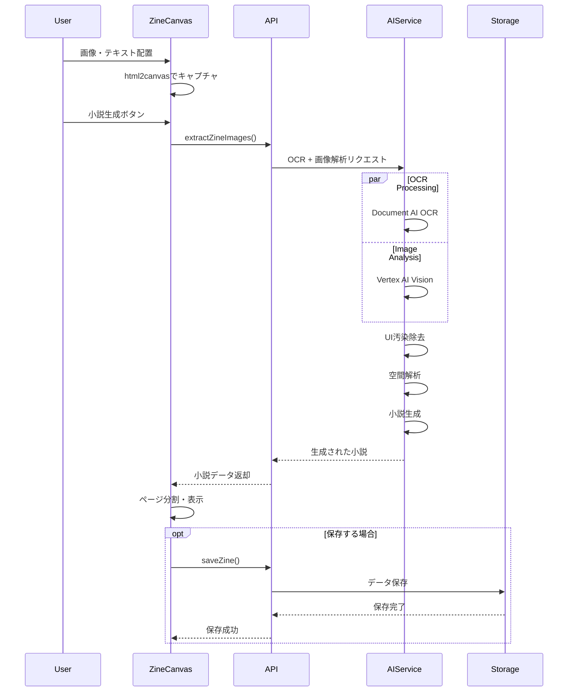
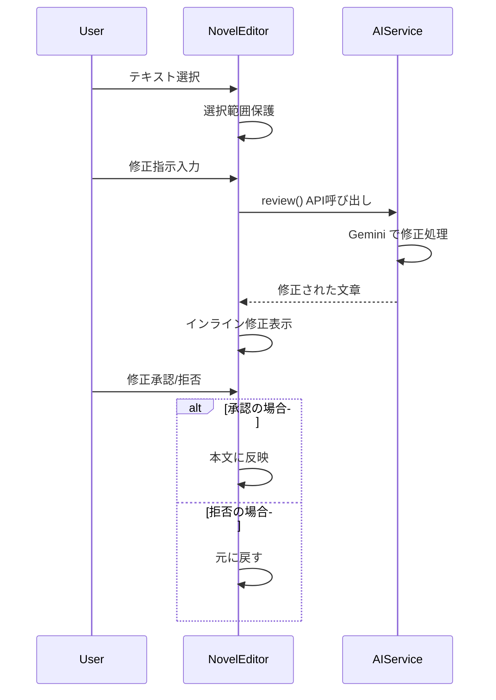
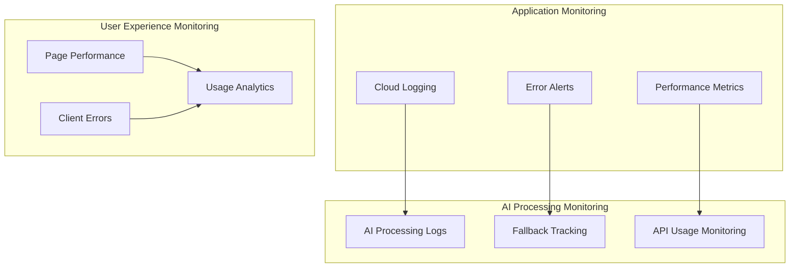
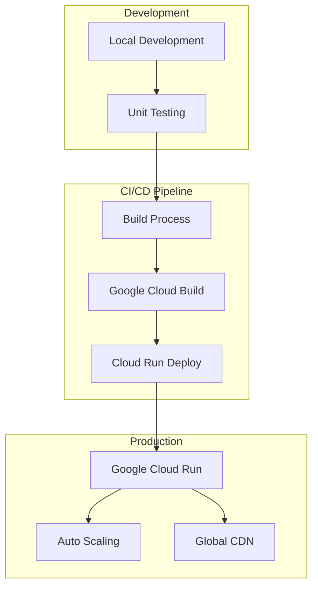

# 🏗️ ZINE-app アーキテクチャ設計書

## 📋 目次
- [システム全体概要](#システム全体概要)
- [フロントエンド アーキテクチャ](#フロントエンド-アーキテクチャ)
- [バックエンド アーキテクチャ](#バックエンド-アーキテクチャ)
- [AI処理パイプライン](#ai処理パイプライン)
- [データフロー](#データフロー)
- [技術スタック詳細](#技術スタック詳細)
- [セキュリティ & 運用](#セキュリティ--運用)

---

## システム全体概要



---

## フロントエンド アーキテクチャ

### 🎨 **コンポーネント階層構造**



### 📁 **ディレクトリ構造**

```
zine-app/
├── app/                          # Next.js App Router
│   ├── globals.css              # グローバルスタイル（アンティーク図書館テーマ）
│   ├── layout.tsx               # アプリケーション全体レイアウト
│   ├── loading.tsx              # ローディング画面
│   └── page.tsx                 # メインページ（24,541行）
├── components/                   # Reactコンポーネント
│   ├── ui/                      # 基本UIコンポーネント（Radix UI + shadcn）
│   ├── zine-creator.tsx         # メインクリエイター（132,242行）
│   ├── ZineCanvas.tsx           # キャンバスコンポーネント（44,728行）
│   ├── novel-viewer.tsx         # 小説ビューア（13,539行）
│   ├── notification.tsx         # カスタム通知システム
│   └── custom-cursor.tsx        # カスタムカーソル
├── lib/                         # ユーティリティ・API
│   ├── api.ts                   # API関数集（14,265行）
│   ├── spatial-analysis.ts     # 空間解析ロジック（10,814行）
│   └── utils.ts                 # 共通ユーティリティ
├── types/                       # TypeScript型定義
│   └── zine.ts                  # ZINE関連型定義
└── public/                      # 静的アセット
```

---

## バックエンド アーキテクチャ

### ⚙️ **API サーバー構造**

```mermaid
graph TD
    subgraph "Express API Server"
        Router[Express Router]

        subgraph "Endpoints"
            Health[/healthz]
            Novelize[/novelize-with-images]
            Review[/review]
            Cover[/cover]
            Embed[/embed]
        end

        subgraph "Middleware"
            CORS[CORS Handler]
            BodyParser[Body Parser 50MB]
            Auth[Authentication]
            ErrorHandler[Error Handler]
        end

        subgraph "Services"
            OCRService[OCR Processing]
            ImageService[Image Analysis]
            NovelService[Novel Generation]
            SpatialService[Spatial Analysis]
        end
    end

    Router --> Health
    Router --> Novelize
    Router --> Review
    Router --> Cover
    Router --> Embed

    CORS --> Router
    BodyParser --> Router
    Auth --> Router
    Router --> ErrorHandler

    Novelize --> OCRService
    Novelize --> ImageService
    Novelize --> NovelService
    Review --> NovelService
    Cover --> ImageService

    OCRService --> SpatialService
```

### 🗄️ **データ管理**



---

## AI処理パイプライン

### 🤖 **7段階AI処理フロー**



### 🔄 **AI冗長性システム**



---

## データフロー

### 📊 **ZINE作成からノベル生成まで**



### 🔄 **リアルタイム協創フロー**



---

## 技術スタック詳細

### 🛠️ **Development Stack**

| レイヤー | 技術 | バージョン | 役割 |
|----------|------|------------|------|
| **Frontend** | Next.js | 15.2.4 | アプリケーションフレームワーク |
| | React | 19 | UIライブラリ |
| | TypeScript | 5 | 型安全性 |
| | Tailwind CSS | 4.1.9 | スタイリング |
| | Framer Motion | latest | アニメーション |
| **Backend** | Express.js | 4.19.2 | APIサーバー |
| | TypeScript | 5.6.2 | サーバーサイド型安全性 |
| **AI/ML** | Google Cloud Document AI | 9.4.0 | OCR処理 |
| | Google Cloud Vertex AI | 1.10.0 | 画像解析・小説生成 |
| | Google Generative AI | 0.24.1 | フォールバック生成 |
| **Infrastructure** | Google Cloud Run | - | サーバーレスホスティング |
| | Google Cloud Storage | 7.12.0 | ファイル管理 |
| **Tools** | html2canvas | 1.4.1 | 画面キャプチャ |

### 📦 **Package Dependencies**

#### フロントエンド主要依存関係
```json
{
  "dependencies": {
    "@radix-ui/*": "1.1-2.2.x", // アクセシブルUIコンポーネント
    "framer-motion": "latest",   // アニメーション
    "html2canvas": "^1.4.1",     // 画面キャプチャ
    "lucide-react": "^0.454.0",  // アイコン
    "class-variance-authority": "^0.7.1", // CSS-in-JS
    "tailwind-merge": "^2.5.5"   // Tailwind結合
  }
}
```

#### バックエンド主要依存関係
```json
{
  "dependencies": {
    "@google-cloud/documentai": "^9.4.0",  // OCR
    "@google-cloud/vertexai": "^1.7.0",    // AI処理
    "@google-cloud/storage": "^7.12.0",    // ファイル管理
    "express": "^4.19.2",                  // APIサーバー
    "cors": "^2.8.5",                      // CORS対応
    "body-parser": "^1.20.2"               // 50MB対応
  }
}
```

---

## セキュリティ & 運用

### 🔒 **セキュリティ対策**

```mermaid
graph TB
    subgraph "Authentication & Authorization"
        OAuth[Google OAuth 2.0]
        JWT[JWT Token Management]
        Scope[API Scope Management]
    end

    subgraph "Data Protection"
        HTTPS[HTTPS Only]
        CORS[CORS Policy]
        Sanitize[Input Sanitization]
        Validate[Data Validation]
    end

    subgraph "Infrastructure Security"
        IAM[Google Cloud IAM]
        VPC[Private Network]
        Encryption[Data Encryption]
    end

    OAuth --> JWT
    JWT --> Scope

    HTTPS --> CORS
    CORS --> Sanitize
    Sanitize --> Validate

    IAM --> VPC
    VPC --> Encryption
```



### 📊 **監視・ログ**



### 🚀 **デプロイメント戦略**



---

## 🎯 **パフォーマンス最適化**

### ⚡ **フロントエンド最適化**
- **Code Splitting**: Next.js自動分割
- **Image Optimization**: Next.js Image Component
- **Lazy Loading**: React.lazy + Suspense
- **Memoization**: React.memo + useMemo

### 🔧 **バックエンド最適化**
- **並列処理**: Promise.all for AI calls
- **メモリ効率**: Stream processing for large files
- **キャッシュ**: Response caching for frequent requests
- **エラー回復**: Graceful degradation with fallbacks

### 📈 **スケーラビリティ**
- **Serverless**: Google Cloud Run自動スケーリング
- **CDN**: Global content delivery
- **Load Balancing**: 自動負荷分散
- **Database**: Cloud Storage for high availability

---

## 📝 **開発・運用ガイドライン**

### 🛠️ **ローカル開発環境**
```bash
# フロントエンド起動
cd zine-app
npm run dev

# バックエンド起動
cd api
npm run dev

# 環境変数設定
GOOGLE_CLOUD_PROJECT=your-project-id
GOOGLE_APPLICATION_CREDENTIALS=path/to/credentials.json
```

### 🔍 **デバッグ・トラブルシューティング**
- **AI処理エラー**: 3層フォールバック確認
- **OCR精度問題**: 画像品質・言語設定確認
- **パフォーマンス**: Chrome DevTools Performance tab
- **メモリリーク**: React DevTools Profiler

---

*このアーキテクチャ設計書は、ZINE-appの技術実装を包括的に説明しています。詳細な実装については、各ソースコードファイルを参照してください。*