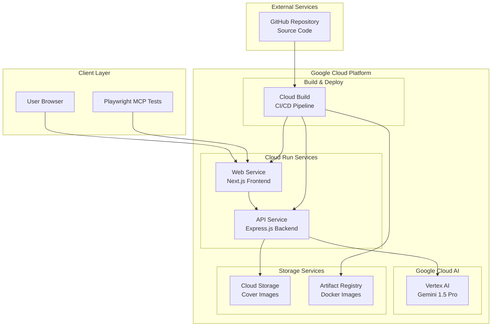

# ZINE作成サービス システムアーキテクチャ (2025-09-03)

## 概要

ZINE作成サービスは、AIを活用したクリエイティブコンテンツ作成プラットフォームです。ユーザーがビジュアル要素を配置し、AI（Vertex AI）が文章生成と編集支援を行う、フロントエンドとバックエンドを分離したマイクロサービスアーキテクチャです。

## システム構成図



## アーキテクチャレイヤー

### 1. フロントエンド層 (Next.js Application)

#### 技術スタック
- **フレームワーク**: Next.js 15.2.4 (React 19)
- **言語**: TypeScript 5
- **スタイリング**: Tailwind CSS 4.1.9
- **アニメーション**: Framer Motion
- **UI コンポーネント**: Radix UI + Shadcn/ui
- **アイコン**: Lucide React
- **状態管理**: React Hooks (useState, useRef)
- **チャート**: Recharts (D3.js ベース)

#### 主要機能
```typescript
// ZINE作成エディター
interface Element {
  id: string
  type: "text" | "image" | "shape"
  x: number
  y: number
  width: number
  height: number
  content?: string
  src?: string
  color?: string
  fontSize?: number
  pageId: string
}

// API連携機能
- novelize(): 小説生成
- review(): 文章レビュー・推敲
- generateCover(): 表紙画像生成
```

#### デプロイ構成
- **プラットフォーム**: Google Cloud Run
- **コンテナ**: Docker (Node.js 20 Alpine)
- **ビルドプロセス**: Multi-stage Docker Build
- **環境変数**: `.env.production`でAPI URLを動的設定

### 2. バックエンド層 (Express.js API)

#### 技術スタック
- **フレームワーク**: Express.js 4.19.2
- **言語**: TypeScript 5.6.2
- **ランタイム**: Node.js 20
- **AI SDK**: @google-cloud/vertexai 1.7.0
- **ストレージ**: @google-cloud/storage 7.12.0
- **CORS**: cors 2.8.5

#### API エンドポイント
```typescript
// 健康チェック
GET /healthz

// 小説生成
POST /novelize
{
  concept: string,
  world: string,
  prompt: string
}

// 文章レビュー・推敲
POST /review
{
  original: string,
  instruction: string
}

// 表紙画像生成
POST /cover
{
  synopsis: string
}

// テキスト埋め込み（将来拡張）
POST /embed
{
  text: string
}
```

#### デプロイ構成
- **プラットフォーム**: Google Cloud Run
- **コンテナ**: Docker (Node.js 20 Alpine)
- **環境変数**:
  - `GOOGLE_CLOUD_PROJECT`: vital-analogy-470911-t0
  - `GOOGLE_CLOUD_LOCATION`: asia-northeast1
  - `COVER_BUCKET`: vital-analogy-470911-t0-covers

### 3. AI・機械学習層

#### Vertex AI 統合
```typescript
const vertexAI = new VertexAI({
  project: "vital-analogy-470911-t0",
  location: "asia-northeast1"
});

// 使用モデル
const model = vertexAI.getGenerativeModel({ 
  model: "gemini-1.5-pro" 
});
```

#### AI機能詳細
1. **小説生成機能**: ユーザー設定（コンセプト、世界観、プロンプト）に基づく長文生成
2. **文章レビュー機能**: 既存テキストの改善・推敲
3. **表紙画像生成**: シノプシスに基づく画像生成（将来実装）
4. **テキスト埋め込み**: セマンティック検索用ベクトル化（将来実装）

### 4. ストレージ層

#### Cloud Storage
- **バケット名**: vital-analogy-470911-t0-covers
- **用途**: 表紙画像、生成コンテンツの保存
- **アクセス**: サービスアカウント認証

#### Artifact Registry
- **リポジトリ**: asia-northeast1-docker.pkg.dev/vital-analogy-470911-t0/zine-repo
- **コンテナイメージ**:
  - `api:latest` - バックエンドAPI
  - `web:latest` - フロントエンドWeb

### 5. CI/CD Pipeline

#### Cloud Build 設定
```yaml
# cloudbuild.yaml
substitutions:
  _REGION: "asia-northeast1"
  _REPO: "zine-repo"
  _WEB_SERVICE: "web"
  _API_SERVICE: "api"

steps:
  1. API Build & Push
  2. API Deploy to Cloud Run
  3. API URL取得 & .env.production生成
  4. Web Build & Push (.env.production含む)
  5. Web Deploy to Cloud Run
```

#### デプロイフロー
1. **ソースコード**: GitHubリポジトリから取得
2. **APIビルド**: Dockerコンテナ作成・プッシュ
3. **API デプロイ**: Cloud Runサービスとして実行
4. **環境変数生成**: APIのURLをフロントエンド用に取得
5. **Webビルド**: 環境変数を含むフロントエンドコンテナ作成
6. **Web デプロイ**: Cloud Runサービスとして実行

## 実装パターン

### 1. ドラッグ&ドロップ システム
```typescript
// requestAnimationFrame最適化
const handleMouseMove = (e: React.MouseEvent) => {
  if (draggedElement && canvasRef.current && !editingElement) {
    e.preventDefault()
    requestAnimationFrame(() => {
      updateElement(draggedElement, { x: constrainedX, y: constrainedY })
    })
  }
}
```

### 2. 日本語入力対応
```typescript
// インライン編集によるIME対応
{editingElement === element.id ? (
  <textarea
    className="w-full h-full p-3 bg-white rounded-lg"
    value={tempTextContent}
    onChange={(e) => setTempTextContent(e.target.value)}
    onBlur={finishTextEditing}
    autoFocus
  />
) : (
  <div onDoubleClick={() => startTextEditing(element.id, element.content)}>
    {element.content || "ダブルクリックで編集"}
  </div>
)}
```

### 3. 小説ページネーション
```typescript
const splitNovelContent = (content: string): string[] => {
  const CHARS_PER_PAGE = 600 // 見やすさ向上
  
  // 長い段落の文単位分割処理
  if (paragraphWithBreak.length > CHARS_PER_PAGE) {
    const sentences = paragraph.split(/([。！？])/g)
    // 自然な文境界で分割
  }
}
```

### 4. ローディング状態管理
```typescript
const [isGeneratingNovel, setIsGeneratingNovel] = useState(false)

const handleNovelize = async () => {
  setIsGeneratingNovel(true)
  try {
    // API呼び出し処理
  } finally {
    setIsGeneratingNovel(false)
  }
}
```

## セキュリティ・認証

### 現在の設定
- **Cloud Run**: `--allow-unauthenticated`で認証なしアクセス
- **API**: CORS設定でクロスオリジンアクセス許可
- **Vertex AI**: サービスアカウント認証

### 将来の拡張計画
- ユーザー認証システム（Firebase Auth）
- API キー認証
- レート制限
- データ暗号化

## パフォーマンス最適化

### フロントエンド
1. **Next.js最適化**: 
   - Static Site Generation (SSG)
   - Code Splitting
   - Image Optimization

2. **レンダリング最適化**:
   - requestAnimationFrame使用
   - React.memo によるメモ化
   - 仮想化による大量データ処理

### バックエンド
1. **API最適化**:
   - レスポンス圧縮
   - 接続プーリング
   - キャッシュ戦略

2. **AI処理最適化**:
   - ストリーミングレスポンス
   - バッチ処理
   - 結果キャッシュ

## 監視・ログ

### Cloud Run 監視
- **メトリクス**: リクエスト数、レスポンス時間、エラー率
- **ログ**: Cloud Logging統合
- **アラート**: しきい値ベースのアラート設定

### アプリケーションログ
- **フロントエンド**: ブラウザコンソール、エラー境界
- **バックエンド**: Express.js標準ログ、Vertex AIログ

## スケーラビリティ

### 水平スケーリング
- **Cloud Run**: 自動スケーリング（0-100インスタンス）
- **負荷分散**: Cloud Run内蔵ロードバランサー
- **リージョン冗長**: asia-northeast1リージョン

### 垂直スケーリング
- **CPU**: 最大2 vCPU
- **メモリ**: 最大8GB
- **同時実行数**: インスタンスあたり最大1000リクエスト

## データフロー

### 小説生成フロー
```
User Input → ZINE Editor → API Request → Vertex AI → 
Generated Novel → Text Splitting → Multi-page Display
```

### 文章改善フロー
```
Selected Text → Style/Onepoint Panel → API Request → 
Vertex AI → Improved Text → Replace Original Content
```

### 作家レビューフロー
```
Selected Text → Chat Interface → Review Request → 
Vertex AI → Writer Feedback → User Interaction
```

## 開発・テスト環境

### ローカル開発
- **フロントエンド**: `npm run dev` (Next.js開発サーバー)
- **バックエンド**: `npm run dev` (ts-nodeによる開発実行)
- **環境変数**: `.env.local`による設定

### テスト環境
- **Playwright MCP**: 自動化ブラウザテスト
- **ペルソナテスト**: ユーザージャーニーテスト
- **API テスト**: 直接エンドポイントテスト

## 今後の拡張計画

### 短期（1-3ヶ月）
1. **ユーザー認証システム導入**
2. **ZINE保存・共有機能**
3. **テンプレート機能**
4. **エクスポート機能（PDF/画像）**

### 中期（3-6ヶ月）
1. **コラボレーション機能**
2. **表紙画像生成の本格実装**
3. **セマンティック検索機能**
4. **多言語対応**

### 長期（6-12ヶ月）
1. **モバイルアプリ開発**
2. **印刷サービス連携**
3. **マーケットプレイス機能**
4. **高度なAI編集機能**

## 運用・保守

### バックアップ戦略
- **ソースコード**: GitHub自動バックアップ
- **設定ファイル**: Cloud Storage保存
- **ユーザーデータ**: 将来のデータベース実装時

### 更新戦略
- **Blue-Green Deployment**: Cloud Runの段階的デプロイ
- **ゼロダウンタイム**: トラフィック段階的移行
- **ロールバック**: 前のリビジョンへの即座復旧

---
**文書作成日**: 2025年9月3日  
**作成者**: Claude Code Assistant  
**アーキテクチャバージョン**: v1.3.0